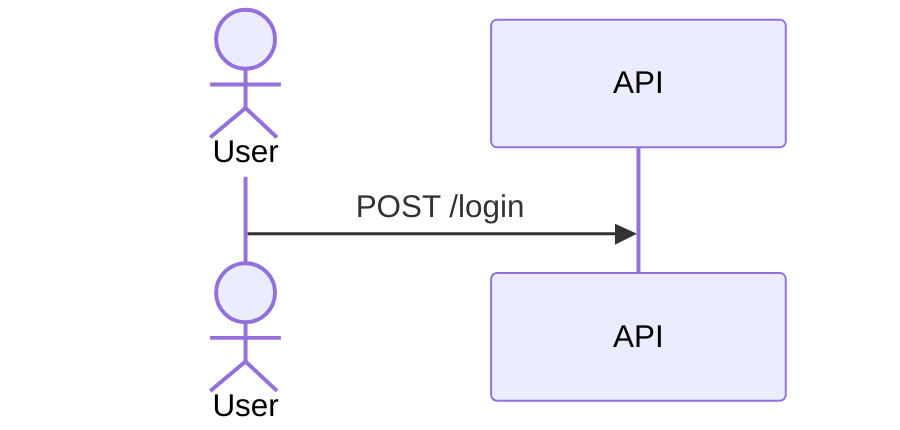

<!-- GENERATED FROM .ai/. DO NOT EDIT DIRECTLY. Run `ai sync`. -->

# PR Blueprint Spec Schema

Specs are Markdown files with YAML-like frontmatter plus Markdown sections.

A spec is a registry document. Its frontmatter carries the `.ai/` registry identity block
(`.ai/project/doc-schema.md`) first, then the blueprint report metadata. `ai blueprint init` emits
exactly the keys below except the optional ones; `ai sync` indexes any spec carrying `type: spec`
into `.ai/_registry.json`, and `ai docs lint` reports every unresolved `relations` target.

Required metadata and optional frontmatter (`ticket` is optional):

```yaml
---
id: spec-auth-flow
type: spec
domain: backend
status: draft
owner: system
relations:
  - type: references
    target: task_07_payment_retry_backoff
preset: backend
title: Auth Flow
kind: app
author: Codex
reviewer: Claude Code
platform: Node / React
version: v1
ticket: GAME-1234
---
```

### Registry identity fields

| Key | Meaning |
|---|---|
| `id` | Unique registry slug, kebab-case, conventionally `spec-<feature-slug>`. Must not collide with any other registry document id. |
| `type` | Always `spec`. This is the `DocType` value that makes the file a registry document. |
| `domain` | Logical domain, e.g. `backend`, `frontend`, `engine`, `control-plane`. |
| `status` | Lifecycle status from the doc-schema `Status` enum: `draft`, `active`, `deprecated`, `archived`, `superseded`. Lowercase. |
| `owner` | Responsible party, or `system`. |
| `relations` | Typed references (`type` + `target`) using the doc-schema `RelationType` enum. `references` a task, `implements` a decision, `supersedes` an earlier spec. `ai blueprint init` emits an empty list. |

`status` is now the registry lifecycle value rather than the free-form report label the legacy
schema used, so write it lowercase (`draft`, not `Draft`): `ai docs stats` matches the doc-schema
enum literally when it walks stale and superseded chains. The blueprint report keys (`preset`,
`title`, `kind`, `author`, `reviewer`, `platform`, `version`, `ticket`) are unchanged and remain
report-only.

Supported presets:

- `frontend`
- `backend`
- `fullstack`
- `api-only`
- `engine`
- `tool`

Supported `kind` values are free-form, but recommended values are:

- `app`
- `api`
- `tool`
- `engine`
- `canvas`
- `game-engine`

## Sections

Use top-level headings:

```markdown
# Overview
# Execution Summary
# File Inventory
# API Endpoints
# WebSocket Messages
# Data Models
# Validation Matrix
# Function Log
# State Matrix
# Component States
# Motion Spec
# Architecture Diagrams
# QA Checklist
# Risks
# Open Questions
# Decisions
# Notes
```

Empty sections are omitted from the generated report.

## Extractor provenance markers

`ai blueprint init --from-task <task-id>` writes source-only HTML comments immediately after each
top-level section heading:

```markdown
<!-- ai:source task.yaml#acceptance_tests -->
<!-- ai:needs-judgment reason="receipt.qa.yaml is absent" -->
```

`ai:source` names deterministic repository facts. `ai:needs-judgment` names a section that still
requires an author decision. The parser validates and captures both forms, then removes the raw
comments from semantic body text; generated reports never show marker syntax as document prose.
Execution Summary and File Inventory are ordinary optional report sections supported by every
preset.

## Heading Aliases

The parser accepts canonical headings and common aliases:

- `metadata`: `metadata`
- `overview`: `overview`, `description`
- `execution_summary`: `execution summary`, `execution`
- `file_inventory`: `file inventory`, `files`
- `api`: `api endpoints`, `api`, `api contract`
- `websocket`: `websocket`, `websocket spec`, `websocket messages`
- `data_models`: `data models`, `models`
- `validation`: `validation matrix`, `validation`
- `function_log`: `function log`, `functions`
- `state_matrix`: `state matrix`, `states`
- `ui_states`: `ui states`, `component states`, `tool states`, `engine states`, `canvas states`
- `motion`: `motion spec`, `motion`
- `architecture`: `architecture diagrams`, `architecture`, `flow diagram`, `flow diagrams`
- `qa`: `qa checklist`, `qa`
- `risks`: `risks`
- `open_questions`: `open questions`
- `decisions`: `decisions`
- `notes`: `notes`

## API Endpoints

````markdown
# API Endpoints
## POST /v1/auth/login
### Description
Authenticate a user.

### Request Headers
- Authorization: Bearer token

### Query Parameters
- redirectTo (string, optional)

### Request Body
```json
{ "email": "user@example.com", "password": "secret" }
```

### Responses
#### 200 OK
```json
{ "accessToken": "..." }
```
````

## WebSocket Messages

````markdown
# WebSocket Messages
## WS Endpoint URL: wss://api.example.com/v1/ws
## Auth: Bearer token

### ClientToServer: submit_intent
#### Description
Send player intent payload.

```json
{ "action": "move", "x": 10 }
```
````

## Data Models

````markdown
# Data Models
## PlayerState
Player position and orientation state.

```ts
interface PlayerState {
  x: number;
  y: number;
}
```
````

## Architecture Diagrams

Every Mermaid diagram needs a title:

````markdown
# Architecture Diagrams
## Login Sequence

````

### Diagram output states

The source grammar above does not change. At build time each diagram is visibly labeled as one of:

- `static-svg`: exact `mmdc` 11.16.0 produced neutral-theme SVG with HTML labels disabled that passed strict XML/SVG safety checks.
- `browser-fallback`: escaped source is rendered by the hash-verified vendored `mermaid` 11.16.0
  runtime, included once in the self-contained report with strict deterministic configuration.
- `source-only`: escaped source remains inert because the runtime is missing or fails provenance/hash
  verification.

CLI absence, version mismatch, failure, timeout, and unsafe output are attributable warnings, not
build failures. Blueprint init/build performs no package install, CDN fetch, or other network call.

## Record Blocks

Validation, functions, states, UI states, and motion use readable YAML-like bullet records.

### Validation Matrix (`validation`)
Required keys: `Field` (or `field_name`), `Type`.

```markdown
# Validation Matrix
- Field: email
  Type: String
  Rules:
    - Must be a valid email
  UI Behavior:
    - Show inline error
  Test ID: val-email
```

### Function Log (`function_log`)
Required keys: `Name` (or `Function`), `Trigger`.

```markdown
# Function Log
- Name: process_payment
  Trigger: User clicks checkout
  Side Effects:
    - Debits account
```

### State Matrix (`state_matrix`)
Required keys: `State` (or `Name`), `Trigger`, `Expected`.

```markdown
# State Matrix
- State: pending
  Trigger: Submit order
  Expected:
    - Show spinner
```

### Component States (`ui_states`)
Required keys: `State` (or `Component` / `Name`), `Surface`, `Expected`.

`Evidence` is optional. It is an ordered list of forward-slash, repository-root-relative PNG
paths. Absolute paths, URI schemes, backslashes, traversal segments, and non-PNG files are invalid.
Existing images are embedded in the static report; a missing or unreadable file produces a visible
warning and no broken image.


```markdown
# Component States
- State: active
  Surface: Main Dashboard
  Expected:
    - Highlight tab
  Evidence:
    - .ai/tasks/done/task_example/evidence/active.png
```

### Motion Spec (`motion`)
Required keys: `Element` (or `Target`), `Property`, `Duration`.

```markdown
# Motion Spec
- Element: Modal
  Property: opacity
  Duration: 200ms
```
