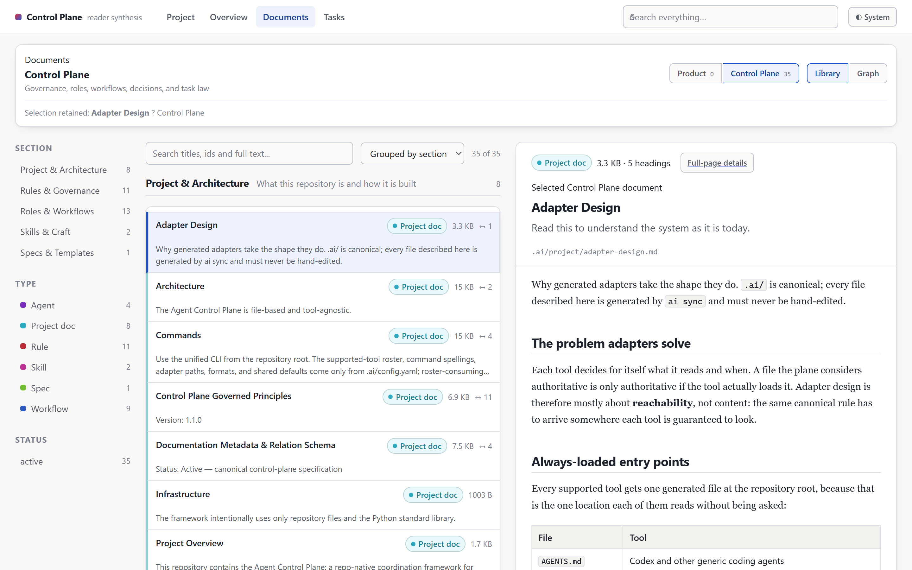

# multi-agents-control-plane

[](https://github.com/QiQi14/multi-agents-control-plane/actions/workflows/ci.yml)
[](LICENSE)
[](https://github.com/QiQi14/multi-agents-control-plane/actions/workflows/ci.yml)

A context-agnostic control plane for running real software work across multiple AI coding agents.

Most agent setups are a prompt file and hope. This is the other thing: a **task state machine with
contracts, receipts, risk gates, and evidence**, so that planning, execution, and review are
separate roles with separate authority — and every claim an agent makes is backed by an artifact
you can open, not by prose you have to trust.

One command drops it into a repository. Stdlib Python only. No services, no daemons, no
system-level install, and nothing written outside your repo.

---

## Who this is for

This project is for repositories where multiple AI coding agents perform substantial, reviewable
software work and prompts alone are no longer enough to control scope, authority, evidence, and
approval.

---

## Status

**v0.2.2 is the current pre-1.0 release.** The core has been exercised across several internal repositories, and CI verifies installation, setup, and removal on Linux, macOS, and Windows with Python 3.10–3.13.

The public CLI and artifact schemas are not yet stable. Minor releases may introduce breaking changes while the project is tested against a broader range of repositories and workflows.

### What changed in v0.2.2

#### Product-aware workspaces

The control plane now discovers products from authoritative manifests such as `package.json`, `Cargo.toml`, and `pyproject.toml`, rather than inferring them from directory names.

Products live under `projects/<product-id>/`. The installer keeps the control plane and each product in separate worktrees, with separate Git state, ignore rules, and agent instructions. It detects whether the plane is shared by a team or used as a local wrapper around an external repository, and configures the workspace accordingly.

#### Project Intelligence

Project Intelligence now indexes product source code rather than the control plane itself.

Language adapters define what they can index, how their index is rebuilt, and which relationships they do not resolve. This release includes a standard-library-only TypeScript and JavaScript indexer that reports packages, modules, files, and declarations without requiring Node.js or `tsc`.

Call resolution is not included yet. Missing relationships are reported as unsupported rather than inferred.

The reader’s package graph now reveals the hierarchy one level at a time, avoiding large flat lists of fully qualified module paths.

#### Documentation workflow

`ai docs serve` starts the reader on a loopback HTTP server and selects an available port automatically.

`ai docs adopt` can register existing Markdown documents without immediately granting them typed registry authority. Documents may also be frozen as `legacy-untyped`, allowing existing repositories to adopt the documentation system incrementally.

`ai doctor` now reports:

* the workspace mode;
* discovered products;
* the selected language adapters;
* whether each project index is built, declared but not built, or unavailable.

Language extensions that are not justified by a discovered product manifest are disabled during installation.

### Added in v0.2.1

`ai usage build` adds a local usage report to the reader’s Overview screen. Usage data remains separate from deterministic documentation builds and exported reports.

Receipts may optionally record the agent session that produced them, allowing usage to be attributed to individual tasks. Attribution is based only on an explicit session identity, never inferred from branch names or timestamps.

For tools that do not report token counts, estimates now use observed conversation growth rather than a flat per-turn multiplier. In the measured calibration set, the proportion of estimates within a factor of two improved from 49% to 98%.

The interactive graph layout now runs until it settles instead of stopping after a fixed frame budget.

### Added since v0.1.0

* `ai usage show` reports locally available agent usage, including recorded tokens, subscription quota, labelled estimates, or `unknown` when no reliable measurement exists.
* `ai docs sync` refreshes task data without rebuilding the full documentation corpus.
* The reader includes an interactive task dependency graph with filterable relation types and lifecycle states.
* `ai docs graph --tasks` exports the task graph as SVG.
* `ai docs graph` reports the output path instead of writing SVG markup to the terminal.

Compatibility beyond the environments covered by CI is still expanding. Repository shapes that the control plane cannot handle should be reported as bugs.

---

## What it looks like

[](examples/)

`ai docs build` projects every rule, workflow, agent, and task into a static, searchable site.
`ai docs export <task>` renders one task to a single portable HTML file you can attach to a merge
request. Both are deterministic — no model in the pipeline, zero token cost.

See **[examples/](examples/)** for the graph view, a rendered task contract, a generated report, and
the sample task they were all built from.

---

## The problem it solves

A single agent that plans, writes, and approves its own work will confidently tell you it is done.
It will also quietly widen scope, skip the test it just broke, and describe evidence it never
produced. Adding a second agent does not fix this on its own — you need somewhere for the
disagreement to live.

This control plane provides that:

- The **contract** is written before the work and is not editable by the agent doing the work.
- The **executor** freezes a bounded diff and writes a receipt.
- An **independent reviewer** reads that exact snapshot against the contract and returns
  `accept`, `revise`, or `reject`.
- **High-risk work** requires a reviewer from a different model family plus explicit human
  approval before anything merges.

The human stays the authority. The agents produce evidence.

---

## What you actually get

### 1. A task state machine

Every unit of work is a folder that moves `queue → active → done → archive`:

```text
.ai/tasks/queue/task_07_payment_retry/
  task.yaml          # the contract: scope, acceptance tests, forbidden files, risk, isolation
  brief.md           # what and why
  context.md         # what the agent must know before starting
  prompt.codex.md    # generated handoff, per tool
  receipt.executor.yaml
  receipt.qa.yaml
```

`task.yaml` names **bounded writable areas and invariants**, not a file-by-file script. The
executor may create and split files freely inside its area; it may not touch anything outside it.
That distinction matters — enumerated file lists routinely block correct engineering judgment at
execution time.

### 2. Four agent roles

`strategist`, `planner`, `executor`, `reviewer` — each with defined authority and, importantly,
defined *limits*. The reviewer cannot silently widen a diff. The executor cannot rewrite its own
contract. Roles are tool-agnostic: any model can hold any role when the contract justifies it.

### 3. Risk gates

Risk tiers select **evidence and approval**, never model prestige:

| Risk | Required |
| --- | --- |
| `low` | scope check |
| `medium` | scope check, tests, QA receipt |
| `high` | research digest, implementation receipt, tests, independent cross-family review, explicit human merge approval |

### 4. Deterministic routing

`ai route explain` recommends a tool and reasoning profile from a versioned taxonomy — task zones,
six orthogonal shape axes, a derived complexity band, and capability tags — and shows its work.
Task *shape* selects the executor profile; *risk* selects gates. Explicit human assignment always
wins, and availability detection is a hint, never authorization.

### 5. Generated adapters, one source of truth

`.ai/` is canonical. `ai sync` renders `AGENTS.md`, `CLAUDE.md`, `GEMINI.md`, `.claude/`, and
`.agents/` from it, tracked by a sha256 manifest so regeneration never clobbers your edits. Adding
a tool is a config entry, not new code. Hand-editing a generated adapter is always the wrong move —
edit `.ai/` and re-sync.

### 6. An extension platform

The core carries no language, stack, or vendor policy. Rust verification, tool integrations, stack
packs, evidence gates, and optional commands are **extensions**, enabled only by being named in
`.ai/config.yaml`. Filesystem presence enables nothing; a missing or malformed registry fails
closed with a named reason rather than falling back to a default.

### 7. Skill packs are yours, not ours

No language or stack pack is enabled by default. A Rust workspace has no use for React guidance,
and a Swift project has no use for Rust standards. Packs remain versioned and maintained by the
teams that actually use them.

A pack is a folder containing rules, workflows, and skill files. Install one from a local or shared
repository:

```bash
ai skills add house-style --from ../our-shared-packs
```

Installed content becomes canonical `.ai/` content, is composed into generated adapters, and is
never overwritten by an upgrade of the control plane. Authoring directly in `.ai/skills/<name>/`
also works. Run `ai sync` after any change.

PR Blueprint is not a pack: it is the agent-facing surface of first-class report commands, so it
remains installed.

### 8. Evidence-led verification

`ai verify` runs a scope-selective pipeline — control-plane only, affected packages, affected plus
reverse dependents, or full workspace — and writes a versioned evidence record. Escalation is
explicit and reasoned (`root-workspace-manifest-changed`, `affected-set-reached-half-workspace`),
runs under a cross-process lock with heartbeats, and fails closed. Raw tool output is never
canonical evidence; the versioned record is.

### 9. Know what a task cost

`ai usage show` reports locally recorded agent usage without accessing the network, credentials, or account state.

```bash
ai usage show --here
```

Each tool is reported according to the data it actually provides:

* Claude Code: recorded token usage
* Codex: recorded token usage and subscription quota
* Antigravity: labelled estimate range
* Unsupported or unreadable tools: **unknown**, never zero

Input, cached input, output, and reasoning tokens remain separate because they may be billed differently.

Billing rates are configured locally in `.ai/.local/billing.json`. Every rate must include an `as_of` date and source. No rates ship with the control plane, since pricing changes too frequently to treat bundled values as authoritative.

Usage remains advisory and never affects task routing.

To include the report in the reader:

```bash
ai usage build
```

Usage is intentionally separate from `ai docs build`. Documentation builds are deterministic repository projections designed to be shared, while usage is machine-local data. The generated usage asset contains per-tool aggregates only and excludes working-directory paths, branches, and session identifiers.

When a tool does not record tokens, the plane estimates usage from conversation growth and presents the result as a labelled range with its assumptions.

Task-level attribution is available only when a receipt records an explicit `session_id`. The plane never infers attribution from branch names or timestamps, and the reader reports how many tasks could be attributed.

### 10. Documentation you can read, and reports you can send

`ai docs build` projects every rule, workflow, agent, skill, project document, and task into a
static, self-contained site: rendered pages, typed relations, backlinks, per-document and global
graphs, a client-side search index, and health metrics for orphans and broken references.
`ai docs lint` fails on unresolved cross-references.

```bash
ai docs build
```

That site serves people who have the repository. For everyone else — a reviewer on a merge request,
a stakeholder with no checkout — one task renders to a single portable file:

```bash
ai docs export task_07_payment_retry
```

It reads the task's own contract, receipts, and evidence, and writes one self-contained HTML report
with diagrams inlined and no runtime dependency. Attach it to an MR, or email it.

**Reach for it after every task, not only when sending one out.** `ai docs build` reprojects the
whole corpus, so its cost grows with the repository — on a mature one that is minutes and a site
measured in hundreds of megabytes. Exporting a single task is effectively instant, because it reads
only that task's record.

To make a finished task current *in the reader* rather than as a separate file, refresh the task
data in place:

```bash
ai docs sync
```

It reprojects the task truth system and rewrites the reader payload through the same writer a full
build uses, so the task pages are exactly what a full build would have produced — on a repository
with a few hundred tasks, seconds against minutes. Documents, relation graphs, and the search index
are left as they were; run the full build when one of those changed. The learn workflow closes with
this step, so a completed task is readable without anyone asking for a rebuild.

Both are fully deterministic: stdlib parse → validate → render, no model in the pipeline and zero
token cost. The difference between them is **audience and scope**, not content — which is why
exporting a task is one command rather than a separate authoring workflow.

When the judgement content *is* the point — a review specification a human settles rather than
derives — `ai blueprint init` and `ai blueprint build` remain the path for a hand-authored spec.

#### Putting your own documents in the graph

The graph is built from your repository, so a document joins it by declaring itself. Add
frontmatter, and the relations you name become edges:

```markdown
---
id: adr-queue-choice
type: decision
domain: control-plane
status: active
owner: platform
relations:
  - type: relates_to
    target: rule-task-contracts
  - type: supersedes
    target: adr-inmemory-queue
---

# Why we moved settlement onto a durable queue
```

```bash
ai docs build
```

That is the whole sync step — the build re-reads the repository every time, so there is no index to
keep in step and nothing to invalidate. `id` is how other documents point at this one, `relations`
are the edges you assert, and edges the plane infers from prose are drawn differently from edges you
declared, so a guess is never presented as your claim.

```bash
ai docs lint
```

`lint` fails on a relation whose target does not exist, which is what stops the graph quietly
rotting as documents are renamed or removed. Run it in CI.

> **Project Intelligence** is the reader's second graph: packages, modules, files, and symbols
> from your own source. 0.2.2 ships two indexers — Python and TypeScript/JavaScript, both standard
> library only — selected from your product's manifests. A stack with no adapter reports itself
> unconfigured and nothing else depends on it. The TypeScript index is structural: it does not
> resolve call edges, and states that rather than inventing them.

---

## Quick start

Two ways in. They produce the same result — pick whichever suits how you work.

### Option A — run it yourself

Clone this repository next to your project, then install into it:

```bash
git clone https://github.com/QiQi14/multi-agents-control-plane
```

```bash
python multi-agents-control-plane/install.py ../my-project
```

That copies `.ai/`, `scripts/`, `ai` and `ai.cmd` into the target and records a manifest of exactly
what it placed. It refuses rather than overwriting anything already there, and `--dry-run` prints
the plan without writing a byte, so you can look before committing to it.

Then, in your project:

```bash
python scripts/ai_cli.py init
```

```bash
python scripts/ai_cli.py sync
```

```bash
python scripts/ai_cli.py doctor
```

`init` creates the scaffold, `sync` generates the adapters for your agents, and `doctor` verifies
interpreter, git, scaffold integrity, config, and registry — it is the first thing to run when
anything looks wrong. On Windows, `ai.cmd` wraps the same entry point.

Then create your first task:

```bash
python scripts/ai_cli.py feature new "Add retry handling to the payment worker"
```

### Option B — let an agent do it

Install as above, open your coding agent in the project, and paste:

```text
This repo now contains a `.ai/` control plane. Please set it up, update project context and sync.
```

Once it is set up, this is how you start real work — no task graph needed up front:

```text
Here is my brief: <describe the
feature, bug, or outcome you want>.

Only plan, do not start implementing.
```

And to run one task through the plane:

```text
Take task <task_id> and work on it.
```

Review is deliberately a **separate session, ideally a different model**:

```text
Review task <task_id>.
```

---

## Updating and removing

Upgrading is the installer again with `--update`. It refreshes the plane and leaves your work alone:
tasks, captured memory, and anything you edited stay as they are.

```bash
git -C multi-agents-control-plane pull
```

```bash
python multi-agents-control-plane/install.py ../my-project --update
```

```bash
cd ../my-project && python scripts/ai_cli.py sync && python scripts/ai_cli.py doctor
```

Removal is manifest-driven, so it can only take back what it gave:

```bash
python multi-agents-control-plane/install.py ../my-project --uninstall --include-generated
```

Files you edited since installing are **kept and reported**, never deleted. Add `--dry-run` to see
exactly what would go first. CI proves on every push that a clean install followed by an uninstall
leaves a repository holding only its own files.

| Flag | Effect |
| --- | --- |
| `--dry-run` | Print the plan, write nothing |
| `--update` | Refresh the plane, preserve tasks, memory and your edits |
| `--force` | Overwrite conflicting files that are already there |
| `--with-tests` | Also install the plane's own suite (several MB of render fixtures) |
| `--uninstall` | Remove recorded, unmodified files |
| `--include-generated` | With `--uninstall`, also remove generated adapters |

### What lands in your repository

```text
.ai/          canonical control plane: rules, workflows, agents, config, templates, task scaffold
scripts/      the plane itself
ai, ai.cmd    launchers
```

`AGENTS.md`, `CLAUDE.md`, `GEMINI.md`, `.claude/` and `.agents/` are **not** installed — `ai sync`
generates them from `.ai/`. If you already have a file at one of those paths, sync will replace it,
and the installer warns you before that happens. Move anything hand-written into `.ai/` first.

---

## Command surface

| Area | Commands |
| --- | --- |
| Setup | `init`, `sync`, `doctor`, `audit-framework` |
| Planning | `feature new`, `research`, `plan`, `route explain` |
| Tasks | `tasks`, `task show`, `dispatch`, `review`, `qa`, `merge`, `learn`, `archive` |
| Verification | `verify`, `cargo`, `cargo-cache`, `impact` |
| Extensions | `ext list`, `ext run`, `tools list`, `tools configure` |
| Usage | `usage show`, `usage build` |
| Skill packs | `skills list`, `skills add`, `skills remove` |
| Documentation | `docs build`, `docs sync`, `docs export`, `docs lint`, `docs search`, `docs stats`, `docs graph`, `docs graph --tasks` |
| Hand-authored specs | `blueprint init`, `blueprint build` |

---

## Layout

| Path | Contents |
| --- | --- |
| `.ai/rules/` | Non-negotiable rules; a reviewer treats a conflict as blocking |
| `.ai/workflows/` | Brief intake, planning, dispatch, execution, QA, review, research, learn |
| `.ai/agents/` | The four roles and their authority |
| `.ai/project/` | Framework docs: overview, architecture, commands, schemas, principles, routing taxonomy |
| `.ai/skills/` | Optional stack packs |
| `.ai/templates/` | Task, project-doc, and PR Blueprint templates |
| `.ai/tasks/` | The task state machine |
| `.ai/memory/` | Typed memory: decisions, lessons, gotchas, API surface, feature ledger, deprecations |
| `.ai/config.yaml` | Tool roster, routing taxonomy, risk gates, isolation strategies, enabled extensions |
| `scripts/` | The plane: `ai_cli.py`, the `ai_plane` package, extension registry, and its stdlib test suite |

---

## Design commitments

- **Self-contained.** Everything lives inside your repository. No daemons, no registry edits, no
  global config. Uninstalling is deleting the folder.
- **Fail closed.** Missing or malformed configuration is an error with a named reason, never a
  silent fallback to a default roster or vocabulary.
- **Evidence is environment-scoped.** A verification record states the machine that produced it;
  it is never silently reused as proof for a different platform.
- **Generated files are generated.** They carry a warning header and a hash manifest; your edits
  are detected rather than overwritten.
- **Honest degradation.** Optional capabilities that a repository has not configured degrade with
  guidance instead of failing the command.

## Tests

```bash
python -m unittest discover -s scripts/tests -t .
```

## Requirements

Python 3.10+ and git. Everything else is optional and belongs to an extension you choose to enable.

## License

Apache License 2.0 -- see [LICENSE](LICENSE) and [NOTICE](NOTICE).

One third-party component is vendored: Mermaid 11.16.0 (MIT), so generated reports render diagrams
offline with no CDN dependency. Its license and pinned provenance ship beside the asset.

## Origin

This control plane began as a standalone design, was then exercised and expanded inside multiple internal projects under continuous adversarial review, and was later extracted back into a domain-neutral core.

The generic framework, test suite, extension platform, routing, documentation projection, and verification substrate are included here. The internal projects' task history, product decisions, and domain-specific content are not.
