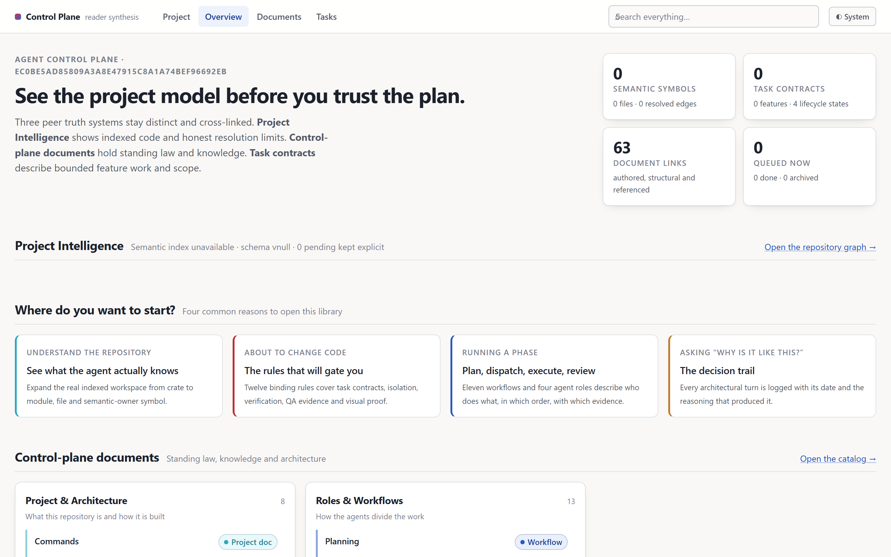
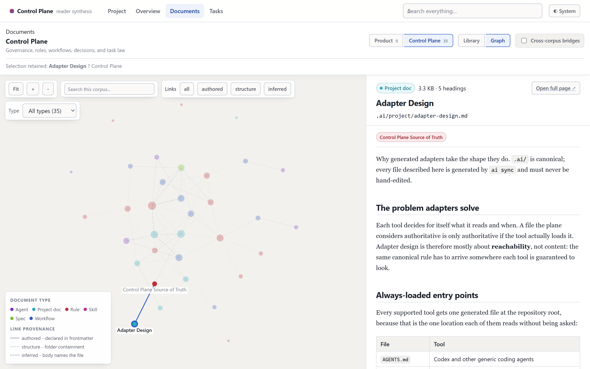
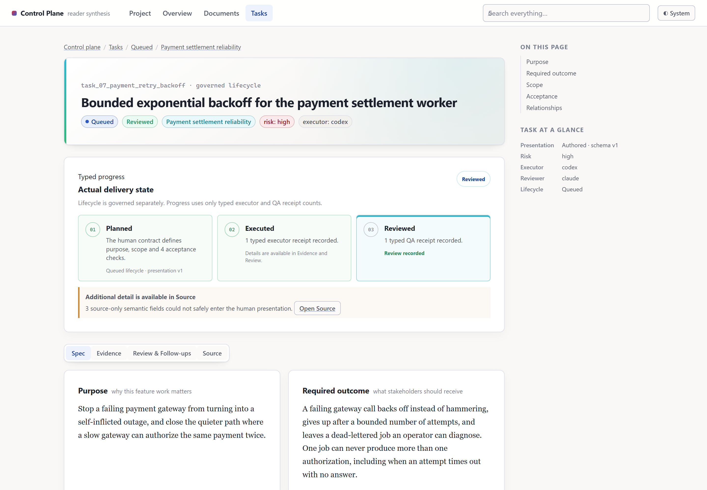
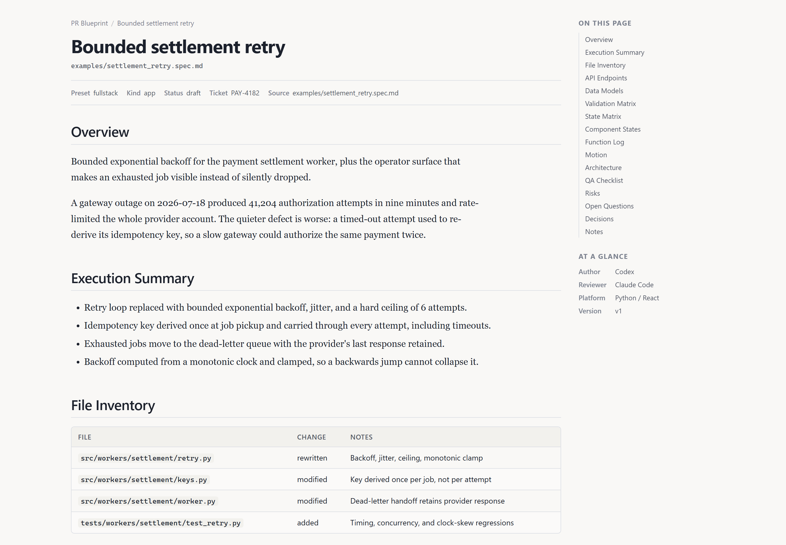
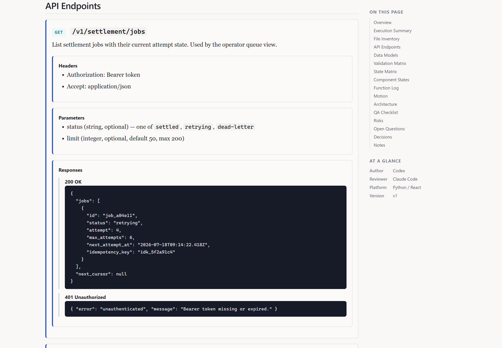
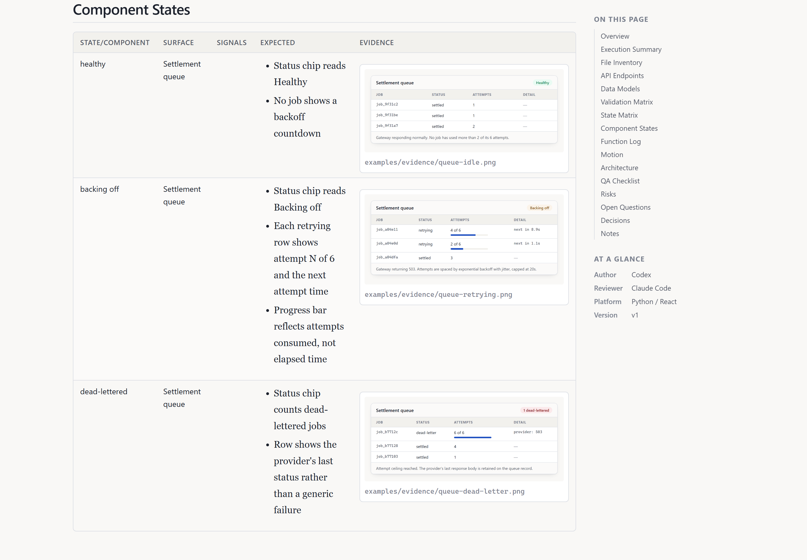

# Examples

What the control plane actually looks like once a repository is using it, plus the sample task the
screenshots were taken from.

Nothing here is loaded by the plane. `.ai/tasks/queue/` stays empty in a fresh clone so your queue
is yours.

---

## The documentation reader

`ai docs build` projects every rule, workflow, agent, skill, project document, and task into a
static site. No model runs in this pipeline and it costs no tokens.

### Overview



Where the reader opens. Three peer truth systems stay distinct and cross-linked, with counts you
can check rather than a claim that everything is fine.

The *Project Intelligence* panel reports **unavailable** here, and that is the honest state: the
source-symbol indexer is not part of this release. An unconfigured optional capability says so
instead of rendering an error.

### Library


Everything the plane governs, grouped by section and filterable by type and status. The right pane
renders the selected document. This is what an agent is pointed at when a rule summary matches the
task it has been given.

### Graph



The same corpus as a relation graph. Edges carry **provenance**, which is the part worth noticing:

- **authored** — declared in the document's own frontmatter
- **structure** — folder containment
- **inferred** — the body names another file

A link a human asserted and a link a machine guessed are never drawn as the same thing.

### A task contract



The human-readable projection of `task.yaml` plus its receipts. Typed progress
(**Planned → Executed → Reviewed**) is computed from receipt counts, not from anyone's claim that
work is done, and the lifecycle badge comes from the folder the task sits in.

Note the honesty affordance near the bottom: *"3 source-only semantic fields could not safely enter
the human presentation"*. The reader will not paraphrase a field it cannot render faithfully — it
says so and links the source.

---

## A portable report



One self-contained HTML file with diagrams inlined and no runtime dependency, so it can be attached
to a merge request or emailed to someone who has never cloned the repository. It shares the reader's
type scale, spacing and colour vocabulary, because a report and the reader are two views of one
repository and should not look like two different tools.

There are two ways to produce one. Derived from a task, when the contract and receipts are the whole
story:

```bash
ai docs export task_07_payment_retry_backoff
```

Or from a hand-authored spec, when the judgement content is the point — API shapes, UI states,
decisions a human settled:

```bash
ai blueprint build examples/settlement_retry.spec.md --out examples/settlement-retry-report.html
```

The site serves people who have the repo. A report serves everyone else. That difference — audience,
not content — is the only reason both exist.

### API request and response



Endpoints carry headers, query parameters, a request body, and **every response keyed by status
code**, not just the happy path. The `409 Conflict` on replay is the interesting one in this example:
it is what stops an operator retry from double-charging a customer whose job actually succeeded.

### Visual evidence



A `Component States` block pairs each state with what is expected and a PNG that shows it. Images
are embedded in the report, so it stays self-contained; a missing file becomes a visible warning
rather than a broken image.

The three screenshots in [`evidence/`](evidence/) are generated deterministically from a local
mockup, so this report can be rebuilt byte-identically without a running application.

Diagrams render offline with no install and no CDN: the Mermaid runtime is vendored in the
repository. The optional `mermaid-cli` only pre-renders static SVG, which makes a report with
diagrams roughly 200x smaller. Its absence is not a warning.

---

## The sample task

[`task_07_payment_retry_backoff/`](task_07_payment_retry_backoff/) is the contract every screenshot
above was rendered from. It is a realistic high-risk task: bounded backoff for a payment worker,
where the visible problem is an outage and the latent one is double-charging a customer.

### The spec

[`settlement_retry.spec.md`](settlement_retry.spec.md) is the hand-authored spec behind the API and
evidence screenshots. It exercises the full grammar: endpoints with typed responses, TypeScript data
models, a validation matrix, a state matrix, component states with image evidence, a motion spec, a
Mermaid lifecycle diagram, and the QA checklist.

```text
task_07_payment_retry_backoff/
  task.yaml              the contract, including the presentation block the reader renders
  brief.md               what happened and why it is worse than it looks
  context.md             the invariants that must survive
  receipt.executor.yaml  what the executor did, with gates and findings
  receipt.qa.yaml        an independent review that returned `revise`
```

Worth reading in this order:

1. **`task.yaml`** — see how `target_files` names *bounded areas*, not a file list, while the
   load-bearing content sits in acceptance tests and invariants.
2. **`receipt.executor.yaml`** — note the executor recording two findings *against its own work*,
   including the one the task existed to prevent.
3. **`receipt.qa.yaml`** — the review returns `revise`, and the reason is instructive: the tests
   passed, but a mutation check showed one of them stayed green with the defect reintroduced. A test
   that cannot fail is not a gate.

That last exchange is the whole point of the plane. Both agents were competent, the suite was green,
and an independent reviewer still found that the gate protecting a customer's money was not load-bearing.

### Reproducing the screenshots

```bash
cp -r examples/task_07_payment_retry_backoff .ai/tasks/queue/
```

```bash
ai docs build
```

```bash
ai docs export task_07_payment_retry_backoff
```

The site is written to `.ai/_site/` (gitignored); open `index.html`. Delete the copied folder from
`.ai/tasks/queue/` when you are done.
