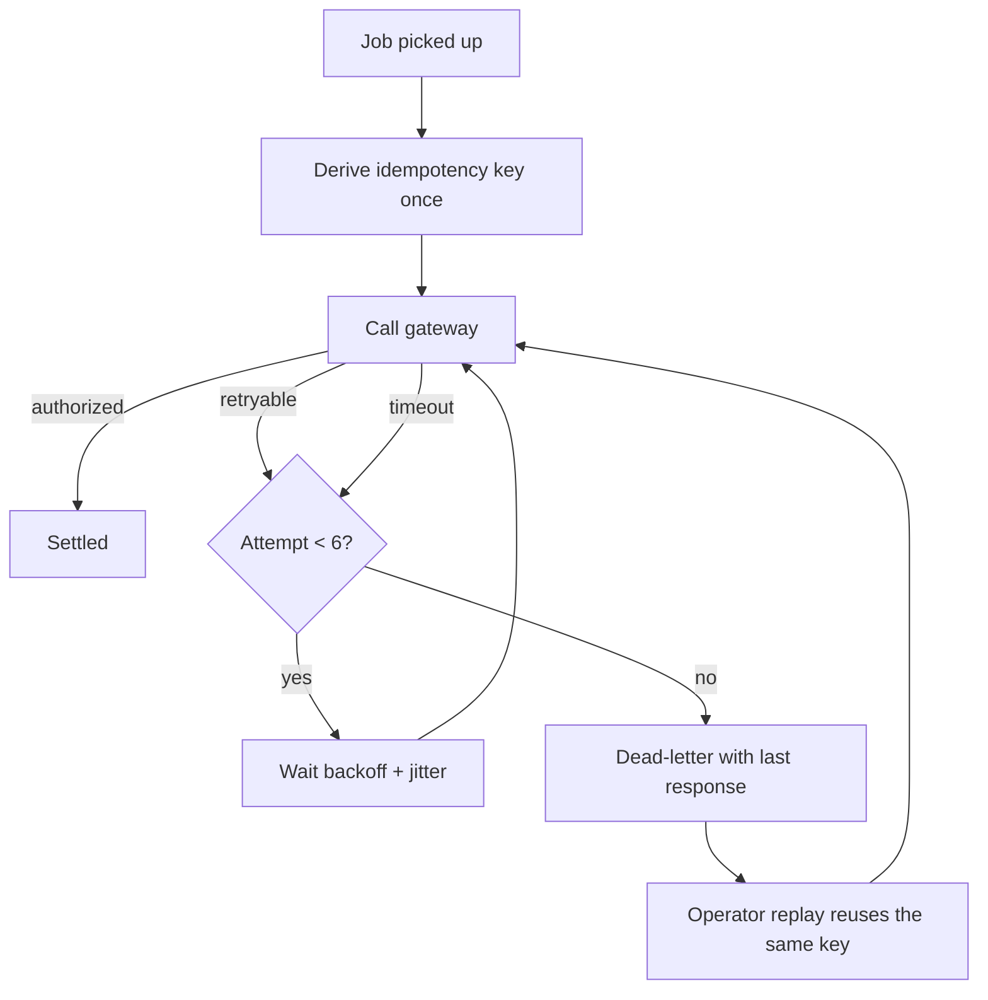

# Overview

Bounded exponential backoff for the payment settlement worker, plus the operator surface that makes
an exhausted job visible instead of silently dropped.

A gateway outage on 2026-07-18 produced 41,204 authorization attempts in nine minutes and
rate-limited the whole provider account. The quieter defect is worse: a timed-out attempt used to
re-derive its idempotency key, so a slow gateway could authorize the same payment twice.

# Execution Summary

- Retry loop replaced with bounded exponential backoff, jitter, and a hard ceiling of 6 attempts.
- Idempotency key derived once at job pickup and carried through every attempt, including timeouts.
- Exhausted jobs move to the dead-letter queue with the provider's last response retained.
- Backoff computed from a monotonic clock and clamped, so a backwards jump cannot collapse it.

# File Inventory

| File | Change | Notes |
| --- | --- | --- |
| `src/workers/settlement/retry.py` | rewritten | Backoff, jitter, ceiling, monotonic clamp |
| `src/workers/settlement/keys.py` | modified | Key derived once per job, not per attempt |
| `src/workers/settlement/worker.py` | modified | Dead-letter handoff retains provider response |
| `tests/workers/settlement/test_retry.py` | added | Timing, concurrency, and clock-skew regressions |

# API Endpoints

## GET /v1/settlement/jobs
### Description
List settlement jobs with their current attempt state. Used by the operator queue view.

### Request Headers
- Authorization: Bearer token
- Accept: application/json

### Query Parameters
- status (string, optional) — one of `settled`, `retrying`, `dead-letter`
- limit (integer, optional, default 50, max 200)

### Responses
#### 200 OK
```json
{
  "jobs": [
    {
      "id": "job_a04e11",
      "status": "retrying",
      "attempt": 4,
      "max_attempts": 6,
      "next_attempt_at": "2026-07-18T09:14:22.418Z",
      "idempotency_key": "idk_5f2a91c4"
    }
  ],
  "next_cursor": null
}
```

#### 401 Unauthorized
```json
{ "error": "unauthenticated", "message": "Bearer token missing or expired." }
```

## POST /v1/settlement/jobs/{job_id}/replay
### Description
Replay one dead-lettered job. The original idempotency key is reused, so a replay can never create a
second authorization for a job that in fact succeeded before dying.

### Request Headers
- Authorization: Bearer token
- Idempotency-Key: caller-supplied, echoed back

### Request Body
```json
{ "reason": "provider incident PAY-4182 resolved", "operator": "ops@example.com" }
```

### Responses
#### 202 Accepted
```json
{
  "id": "job_b7712c",
  "status": "retrying",
  "attempt": 1,
  "idempotency_key": "idk_3c88ff01",
  "note": "Original key reused; a prior authorization will be detected as a duplicate."
}
```

#### 409 Conflict
```json
{
  "error": "already_settled",
  "message": "The job settled on a prior attempt. No replay was performed.",
  "settled_at": "2026-07-18T09:22:07.004Z"
}
```

#### 422 Unprocessable Entity
```json
{ "error": "not_dead_lettered", "message": "Only a dead-lettered job can be replayed." }
```

# Data Models

## SettlementJob
One settlement job as the operator surface sees it. `idempotency_key` is derived once at pickup and
is stable across every attempt, which is what makes a replay safe.

```ts
interface SettlementJob {
  id: string;
  status: "settled" | "retrying" | "dead-letter";
  attempt: number;          // 1-based, never exceeds max_attempts
  max_attempts: number;     // 6
  next_attempt_at: string | null;   // RFC 3339; null unless retrying
  idempotency_key: string;          // stable across attempts, including timeouts
  last_provider_response: ProviderResponse | null;  // retained when dead-lettered
}
```

## ProviderResponse
Retained verbatim when a job dead-letters, so an operator can open a provider ticket without
re-running the payment.

```ts
interface ProviderResponse {
  status: number;
  request_id: string | null;   // provider correlation id, from response headers
  body: string;
  received_at: string;
}
```

# Validation Matrix

- Field: limit
  Type: Integer
  Rules:
    - Between 1 and 200
    - Defaults to 50 when absent
  UI Behavior:
    - Clamp silently; never error the list view
  Test ID: val-limit
- Field: reason
  Type: String
  Rules:
    - Required on replay
    - 8 to 500 characters
  UI Behavior:
    - Inline error under the field; submit stays disabled
  Test ID: val-replay-reason

# State Matrix

- State: retrying
  Trigger: Gateway returns a retryable status
  Expected:
    - Attempt counter increments
    - Next attempt scheduled with jitter
    - No second attempt dispatched while one is in flight
- State: dead-letter
  Trigger: Attempt ceiling reached
  Expected:
    - Job leaves the active queue
    - Provider's last response body retained
    - Replay control becomes available
- State: settled
  Trigger: Gateway authorizes
  Expected:
    - Attempt counter frozen
    - Idempotency key retained for duplicate detection

# Component States

- State: healthy
  Surface: Settlement queue
  Expected:
    - Status chip reads Healthy
    - No job shows a backoff countdown
  Evidence:
    - examples/evidence/queue-idle.png
- State: backing off
  Surface: Settlement queue
  Expected:
    - Status chip reads Backing off
    - Each retrying row shows attempt N of 6 and the next attempt time
    - Progress bar reflects attempts consumed, not elapsed time
  Evidence:
    - examples/evidence/queue-retrying.png
- State: dead-lettered
  Surface: Settlement queue
  Expected:
    - Status chip counts dead-lettered jobs
    - Row shows the provider's last status rather than a generic failure
  Evidence:
    - examples/evidence/queue-dead-letter.png

# Motion Spec

- Element: Backoff countdown
  Property: opacity
  Duration: 120ms
  Notes:
    - Ticks without layout shift; the row height is fixed
- Element: Dead-letter banner
  Property: transform
  Duration: 180ms
  Notes:
    - Respects prefers-reduced-motion; falls back to an instant swap

# Architecture Diagrams

## Retry lifecycle


# Function Log

- Name: next_delay
  Trigger: A retryable response or timeout
  Side Effects:
    - Reads a monotonic clock, never the wall clock
    - Returns a jittered delay clamped to the 20s cap
- Name: derive_key
  Trigger: Job pickup
  Side Effects:
    - Writes the key to the job record exactly once

# QA Checklist

- A 30s gateway outage produces at most 6 attempts for one job
- Attempt gaps strictly increase and carry non-zero jitter
- Two workers on one job authorize exactly once, including a timeout interleaving
- Largest observed gap is asserted, not the configured cap
- A backwards clock jump never yields a zero or negative delay
- `src/ledger/**` and `migrations/**` are byte-unchanged

# Risks

- A retry that loses its idempotency key double-charges a customer. Invisible in aggregate metrics,
  so the concurrency test is the gate rather than the dashboards.
- A backoff bug converts a partial outage into an account-wide rate-limit ban affecting every tenant.

# Open Questions

- Should replay be rate-limited per operator, or is the idempotency key sufficient protection?
- Does the provider's `Retry-After` header, when present, override our computed backoff?

# Decisions

- Ceiling fixed at 6 attempts rather than a time budget: attempts are what the provider rate-limits.
- Dead-letter retains the full provider response including headers, because the provider request id
  is what support needs to open a ticket.

# Notes

Evidence images in this spec are generated deterministically from a local mockup, so the report can
be rebuilt byte-identically without a running application.
