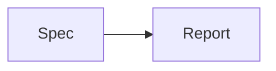

# Overview
The **dashboard** uses `render_report` and links to [the repository](../../../../README.md), [HTTPS](https://example.com), and [mail](mailto:test@example.com).

| Surface | Result |
| --- | --- |
| Main `<script>` | **Stable** |
| Narrow | `No clipping` |

Raw  stays text. [unsafe](javascript:alert(1)) and [data](data:text/html,bad) stay non-clickable.

# Validation Matrix
- Field: title
  Type: String
  Rules:
    - Escaped before rendering
  UI Behavior:
    - Display safely
  Test ID: static-title

# State Matrix
- State: ready
  Trigger: Build completes
  Expected:
    - Show report

# Component States
- State: active
  Surface: Main Dashboard
  Signals:
    - Report opened
  Expected:
    - Evidence is visible
  Evidence:
    - scripts/tests/fixtures/pr-blueprint/evidence/active.png
    - scripts/tests/fixtures/pr-blueprint/evidence/missing.png

# Motion Spec
- Element: Report card
  Property: opacity
  Duration: 0ms

# Architecture Diagrams
## Static Flow

# QA Checklist
- Inspect desktop and narrow layouts.

# Risks
- Missing evidence must remain visible as a warning.

# Open Questions
- None.

# Decisions
- Keep the report self-contained.

# Notes
Use **safe formatting**, `inline code`, and [a fragment](#component-states).
